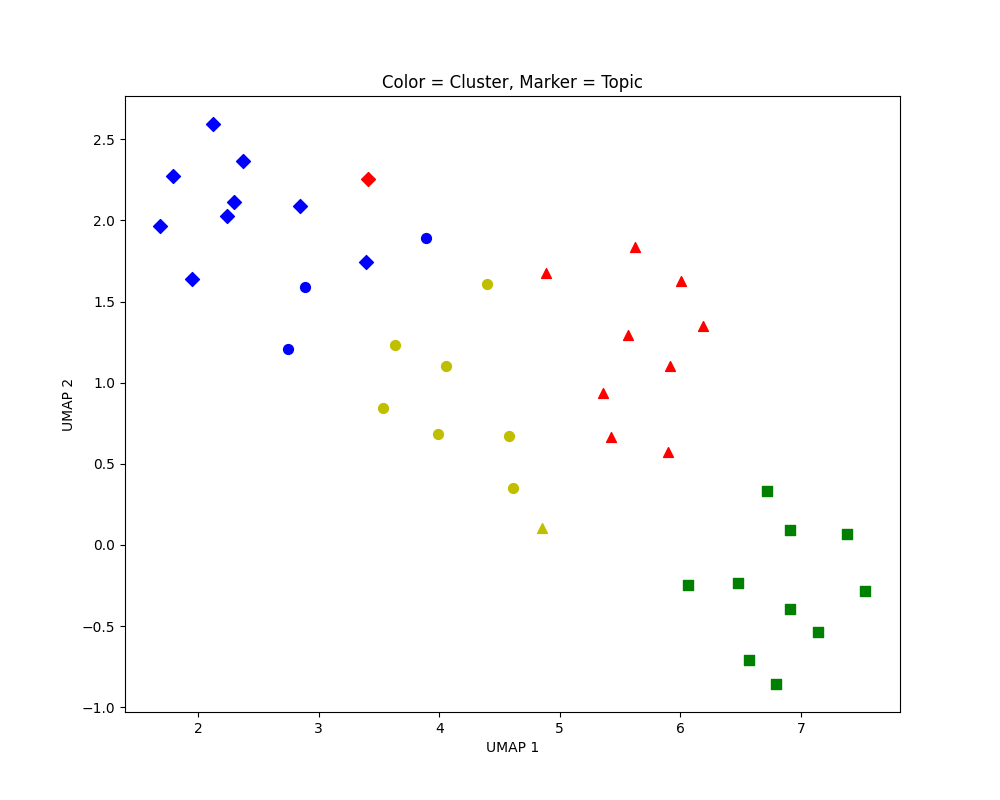

# Interview Briefing Document

## Overview
During NLP projects, it is common to cluster documents based on their content. This project aims to assess the candidate's ability to perform k-means clustering and downproject high-dimensional embeddings to 2D for visualization. Textual content has already been embedded using 1536-dimensional vectors.

## Assessment

The aim of the interview is to assess the candidate's ability to

(1) Perform k-means

(2) Perform downprojection

Overall, these are the steps that the candidate should follow:
1. Load the data (Done)
2. Perform k-means
3. Check agreement between inferred clusters and ground truth (Done)
4. Perform downprojection
5. Visualize the clusters (Done)

- `load_data()`: Loads the dataset from a pickle file and filters for specific topics. The textual data is embedded using vectors of length 1536.
- `perform_k_means(dfr: pd.DataFrame) -> pd.DataFrame`: Placeholder for performing KMeans clustering on the embeddings in the DataFrame.
- `check_agreement(dfr: pd.DataFrame) -> None`: Checks the agreement between topics and clusters by calculating the proportion of each topic in each cluster.
- `downproject_2D(dfr: pd.DataFrame) -> pd.DataFrame`: Placeholder for downprojecting the embeddings to 2D.
- `plot_2D(dfr: pd.DataFrame) -> None`: Plots the 2D embeddings with cluster labels as colors and topic labels as markers.

## The Data
You will be working with `dfr = pd.read_pickle('sampled_df.pkl')`, here is a sample of the dataframe:

|   | text_content | topic | embedding |
|---|--------------|-------|-----------|
| 3 | From: jgreen@amber (Joe Green)\nSubject: Re: W... | 1 | [-0.03768625110387802, -0.013556155376136303, ... |
| 5 | From: dfo@vttoulu.tko.vtt.fi (Foxvog Douglas)\... | 16 | [0.099097341299057, 0.04781849682331085, 0.059... |
| 14 | From: jllee@acsu.buffalo.edu (Johnny L Lee)\nS... | 6 | [-0.008013405837118626, -0.012976933270692825,... |
| 16 | From: ab@nova.cc.purdue.edu (Allen B)\nSubject... | 1 | [-0.018138250336050987, 0.013053249567747116, ... |
| 22 | From: rpwhite@cs.nps.navy.mil (rpwhite)\nSubje... | 6 | [-0.021558072417974472, 0.012204996310174465, ... |
| 25 | From: kph2q@onyx.cs.Virginia.EDU (Kenneth Hinc... | 1 | [-0.05273938551545143, -0.007428179960697889, ... |
| 30 | From: mrh@iastate.edu (Michael R Hartman)\nSub... | 6 | [-0.010258182883262634, -0.028311755508184433,... |
| 37 | From: ebrandt@jarthur.claremont.edu (Eli Brand... | 11 | [0.043688055127859116, 0.022979794070124626, 0... |
| 39 | From: bressler@iftccu.ca.boeing.com (Rick Bres... | 16 | [0.005724058952182531, 0.05975713953375816, -0... |
| 55 | From: cme@ellisun.sw.stratus.com (Carl Ellison... | 11 | [0.02274213172495365, 0.004682416561990976, 0... |

## Visualization

The required outputs are visualized in the `clusters.png` file. The plot shows the 2D embeddings with cluster labels as colors and topic labels as markers. The title of the plot is "Color = Cluster, Marker = Topic", and the axes are labeled "Axis 1" and "Axis 2".

There are only 4 topics included as indicated by 4 types of markers. In k-means, k is set to 4, therefore, there are four colours.

